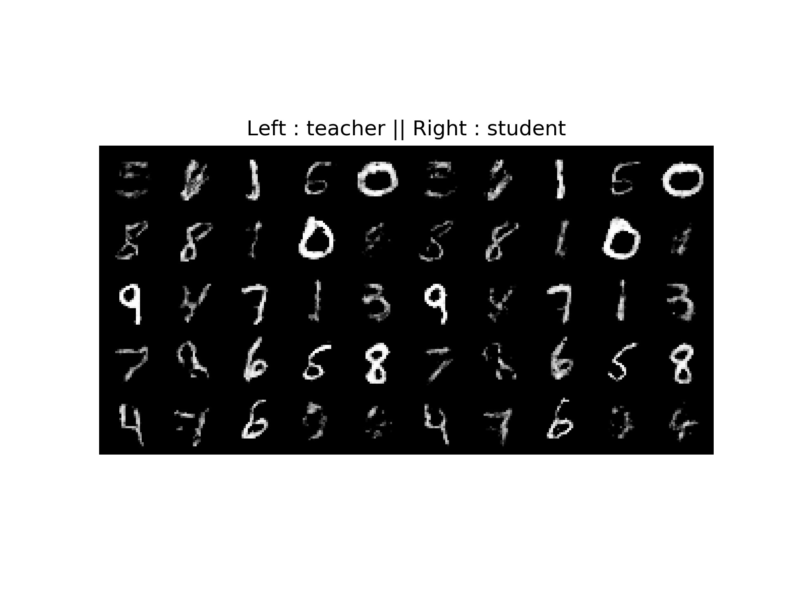

# Reproducing ***Compressing GANs using Knowledge Distillation***

First of all, thank the authors very much for sharing this excellent paper ***<Compressing GANs using Knowledge Distillation>*** with us. This repository contains reproducing both training and testing code for the idea orginated from paper. If there are some bug problems in the 
implementation, please send me an email at yuranusduke@163.com.

## Backgrounds
In this paper, authors used a simple yet effective method to compress GANs(WGAN-GP in particular) using 
knowledge distillation(a.k.a. KD), which is to my knowledge the first successful try in applying KD for GANs. Conceptually, they tried two different ways to achieve the goal. First is,


which directly mimics teacher's generator outputs. Second is,


which both utilizes simple GAN learning strategy and the above KD strategy.

In this repo, we focus the second one. We can also tune hyper-parameter in code to approximately try the first one.

## Requirements

```Python
pip install -r requirements.txt 
```

## Implementations

**NOTE**: We only implement this paper as a simple start, if there are more excellent papers about distilling GANs,
We can just simple add new paper's implementations without having to change code organization.

### Code Organization
```bash
├── DistillGANs/
│   ├── checkpoints/                              /* trained models
|        ├── eval_models/                         /* evaluation models for evaluating GANs 
|        ├── kdforgan/                       	  /* compressed GANs
|		 ├── ...
|        ├── teacher_models/                      /* trained teacher GANs
|   |── data/                   				  /* folder to store data sets
|   ├── models/         						  /* all models implementations
|        ├── KDforGAN.py/                         /* all models
|        ├── LeNet5.py/                           
|        ├── ...                            
|   ├── results/                                  /* folder to store results
|        ├── kdforgan/                            /* compressed GANs results
|        ├── ... 
│   ├── train/                                    /* folders to store training results
|        ├── trainKDforGAN.py                     /* training details for GANs
|        ├── ...
│   ├── test/                               	  /* folders to store testing results
|        ├── testKDforGAN.py                      /* testing details for GANs
|        ├── ...
│   ├── README.md
│   ├── README/                                   /* README images
|   ├── main.py                                   /* main function configuration
|   ├── models_def.py                             /* models function definitions
|   ├── train_def.py                              /* train function definitions
|   ├── utils.py                                  /* utility functions, including plotting, data, ...
|   ├── test_def.py                               /* test function definitions
|   ├── configs.py    							  /* models configurations
|   ├── run.sh   								  /* running script
|   ├── requirements.txt			  
```

### Hyper-parameters and defaults
```bash
--data_name: data set name, default is 'mnist', including 'cifar10'/'cifar100' as well
--data_dir: data set directory, default is './data/'
--img_height: image height, default is 32
--img_width: image height, default is 32
--img_channels: image channels, default is 3

--noise_dimension: input noise\'s dimension, default is 100
--noise_distribution: 'gaussian' or 'uniform', default is 'gaussian'
                    with mean 0 and 1 as std, 'uniform' with [-1, 1]
--model_name: default is 'kdforgan'
--alpha_kdforgan: hyperparameter in KDforGAN model to trade off between
                    teacher generator loss and student generator loss, default is 0.3
--scale: scale factor for reducing parameters in the net,
				default is 0.2, for each layer, we multiply scale with original channels
                in the teacher model
--device: training or testing device, tell by if cuda is available
--epochs: training epochs, default is 100
 --batch_size: training & testing batch size, default is 32
--plot_interval: how many epochs to visualize results, default is 10
--save_model_dir: saved model directory, default is './checkpoints/'
--only_test: default is False, if False, training will be executed
                else test only, but will first check if trained model exists
--save_res_dir: saving results directory, default is './results/'
--num_vis: number of visualize images, default is 25, must be complete-squared
```

### Train

**Option 1**

Change hyper-parameters in run.sh, simply run

```python
. ./run.sh
```

**Option 2**

```python
        python main.py main \
        --data_name='mnist' \
        --data_dir='./data/' \
        --img_height=28 \
        --img_width=28 \
        --img_channels=1 \
        --noise_dimension=100 \
        --noise_distribution='gaussian' \
        --model_name='kdforgan' \
        --alpha_kdforgan=0.3 \
        --scale=0.2 \
        --epochs=50 \
        --batch_size=64 \
        --plot_interval=10 \
        --save_model_dir='./checkpoints/' \
        --only_test=False \
        --save_res_dir='./results/' \
        --num_vis=25

```

### Test
```python
        python main.py main \
        --data_name='mnist' \
        --data_dir='./data/' \
        --img_height=28 \
        --img_width=28 \
        --img_channels=1 \
        --noise_dimension=100 \
        --noise_distribution='gaussian' \
        --model_name='kdforgan' \
        --alpha_kdforgan=0.3 \
        --scale=0.2 \
        --epochs=50 \
        --batch_size=64 \
        --plot_interval=10 \
        --save_model_dir='./checkpoints/' \
        --only_test=True \
        --save_res_dir='./results/' \
        --num_vis=25

```

## Results

### MNIST

With `alpha_kdforgan=0.3` and `scale=0.1`, we get

#### Epoch 1


#### Epoch 11


#### Epoch 26


#### Epoch 46


#### Losses


### Cifar10
With `alpha_kdforgan=0.3` and `scale=0.1`, we get

#### Epoch 1


#### Epoch 11


#### Epoch 26


#### Epoch 46


#### Losses


However, if we set `alpha_kdforgan=0.`, which means we only use MSE loss in compressing GANs, we get


This result is corresponding well to the original paper.

## Paper References
- Compressing GANs using Knowledge Distillation [[arXiv]](https://arxiv.org/abs/1902.00159)

## Thank you, if you have more excellent ideas, welcome to pull request!

***<center>Veni，vidi，vici --Caesar</center>***
